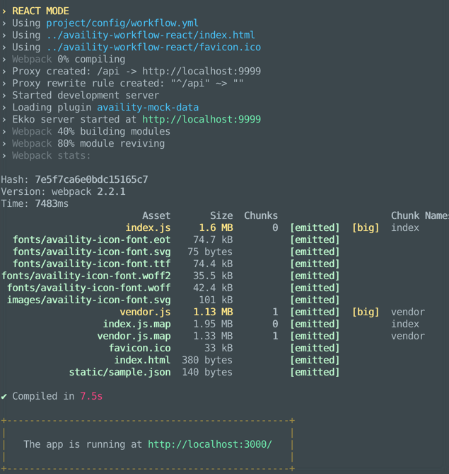

# availity-workflow

> Upgradable workflow for Availity boilerplate projects

[](http://opensource.org/licenses/MIT)
[](https://npmjs.org/package/availity-workflow)



## Table of Contents
* [Installation](#installation)
* [Authors](#authors)
* [License](#license)

## Getting Started

- Install using NPM

```bash
npm install availity-workflow --save-dev
```

- Install the appropriate plugin

**React**
```bash
npm install availity-workflow-react --save-dev
```

**Angular**
```bash
npm install availity-workflow-angular --save-dev
```

- Update `packge.json` with plugin reference

```json
{
    "availityWorkflow": {
        "plugin": "availity-workflow-react"
    }
}
```

- Install developer tools

```
npm i eslint eslint eslint-config-availity eslint-plugin-react babel-eslint
```
## Disclaimer

Open source software components distributed or made available in the Availity Materials are licensed to Company under the terms of the applicable open source license agreements, which may be found in text files included in the Availity Materials.

## License

Copyright (c) 2017 Availity, LLC. Code released under the [the MIT license](LICENSE)
