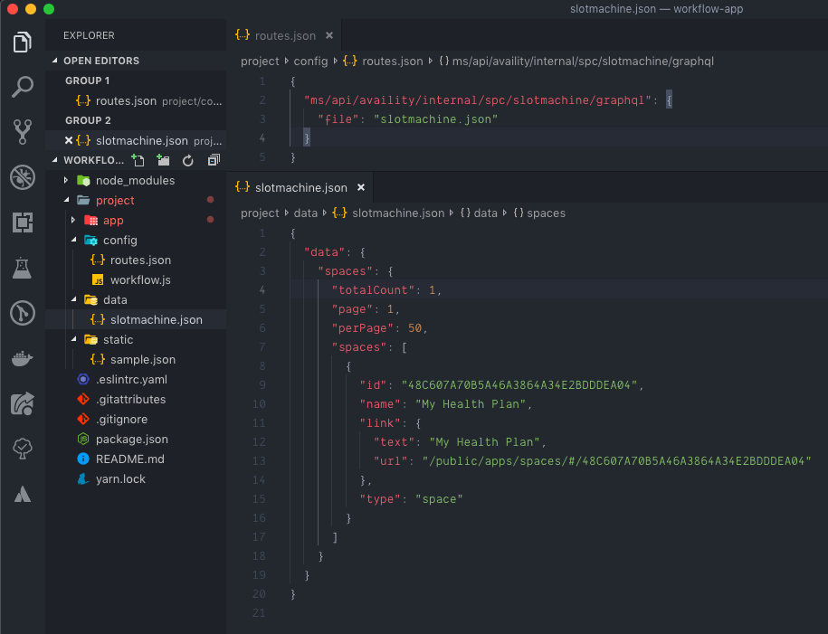

When developing Availity applications there is no use in a UI that doesn't connect to some data source. There are a few ways a developer can get data when developing locally:

1. Proxy requests from the local webpack-dev-server to the target API environment and have the proxy handle the authentication.
2. Spin up a local mock server to accept inbound requests and respond with fake data.

Lucky for you, we have built a local mock server into workflow that will return mock data for most of the APIs that we support.

## Mock Data Structure



Inside of the `config` folder is a file titled `routes.json`. This contains an object `key/value` pair of all the API routes you override from your UI.

In our case, we have an API call being made that requests data from `/ms/api/availity/internal/spc/slotmachine/graphql`.

The key of the nested object is a `file` type, thus we specify its a `file` and the value is the path to the data file we want returned.

The above pictured scenario can be explained by saying "the specified path will return JSON containing the data from the file `data/slotmachine.data`. Note that the JSON will be returned for any type of request method, and parameters passed in. See the full list of [examples](/reference/mock-server/#route-configuration-examples) for more advanced configurations.

## Starting Mock Server

By default, if you have not modified your `workflow.js` file the mock server will automatically start up and be running. This can be disabled by setting `development.mock.enabled` to `false` in the configuration file.

The easiest way to know if the server is running is you should see a message saying `Ekko servered started at...`.

```shell hideCopy=true
Workspaces/workflow-app is 📦 v0.1.0 via ⬢ v12.14.0 took 11s 487ms yarn start
yarn run v1.21.1
$ av start
› REACT
› Using project/config/workflow.js
› Using @availity/workflow/public/index.html
› Using @availity/workflow/public/favicon.ico
› Webpack 0% compiling
› Webpack 10% building
› Proxy created: [ '/api', '/ms' ] -> http://localhost:51484
› Proxy rewrite rule created: "^/api" ~> ""
ℹ ｢wds｣: Project is running at http://localhost:3000/
ℹ ｢wds｣: webpack output is served from undefined
ℹ ｢wds｣: Content not from webpack is served from /Users/kgray/Workspaces/proving-grounds/workflow-app/build
ℹ ｢wds｣: 404s will fallback to /index.html
› Started development server
› Loading plugin @availity/mock-data
› Ekko server started at http://localhost:51484
```

## Example

The best way to learn is by examples and that is what we are going to do here.

We are going to clear out the `App.js` file for tesing purposes and instead paste the below code snippet.

### Adding API Code Snippet

```jsx header=App.js
import React, { useEffect, useState } from 'react';
import { avUserApi } from '@availity/api-axios';

const App = () => {
    const [name, setName] = useState(''); // initialize state

    const fetchData = async () => {
        const user = await avUserApi.me(); // Request current user

        setName(user.firstName); // set the name to state
    };

    // Fetch the user on component mount
    useEffect(() => {
        fetchData();
    }, []);

    return <div>Hello {name}</div>;
};

export default App;
```

The above code snippet runs a method called `fetchData` on mount that will fetch the user's `firstName` using the `avUserApi` from `@availity/api-axios`. You can read more on what that resource looks like [here](https://github.com/Availity/sdk-js/tree/master/packages/api-axios).

Since we know the route is going to look like `api/sdk/platform/v1/users/me` we can mock it out in the `routes.json` by adding the following to our file:

### Adding a new Route

```json header=routes.json
{
    "ms/api/availity/internal/spc/slotmachine/graphql": {
        "file": "slotmachine.json"
    },
    "sdk/platform/v1/users/me": {
        "file": "user.json"
    }
}
```

Note that we can strip the prefixing `/api` as the mock server takes that off automatically.

### Adding Response Data

Now that we have the route we need to mock out our `user.json` response:

```json header=user.json
{
    "firstName": "Kyle"
}
```

We added a simple response object with one key that is the `firstName` used to render in the App.

If your application is currently running you will need to restart it as the mock server will need to be restarted in order to get the updated mock data.

If all goes correct you should see the Application rendering

```bash hideCopy=true
Hello Kyle
```

> For more examples you checkout the [mock server reference page](/reference/mock-server/#route-configuration-examples).

Congratulations on making it this far! By now you should be able to fully build out an application API ready. Next we will discuss the build steps that workflow provides and how to get your application deployed on our portal.
