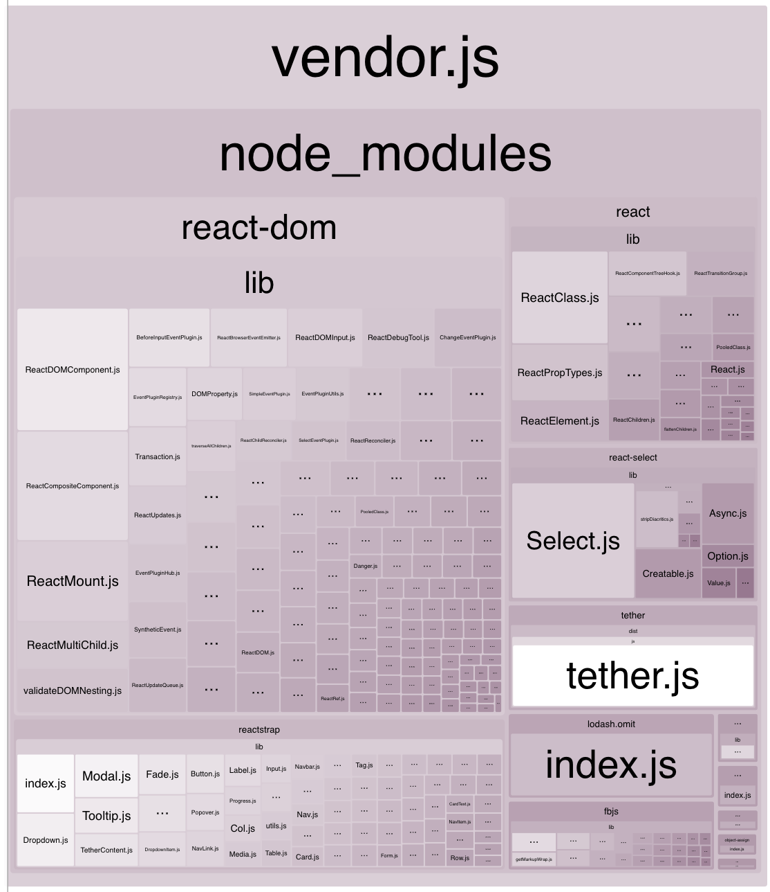

# CLI

## NPM
> NPM requires `--` between the command and options
```bash
npm run <command> -- <options>
```

## Commands

### `help`
Show help menu for all CLI options.

### `start`
Start the development server and watches for file changes.  Hot-reloading is enabled for React projects.  Angular projects hot reload CSS only.

#### options

##### `--dry-run`
Start the development server using production settings. **Example:**

`npm start -- --dry-run`

### `lint`
Lint project files using EsLint.

#### options

##### `--include`
Include additional glob patterns for linting.

### `release`
- Prompts the user for a version
- Cleans up `/dist` folder
- Bundles project assets into the `/dist` folder
- Tags the version in Git

#### NODE_ENV

##### `production`
Minifies the javascript assets.

##### `staging`
No minification is done on javascript assets

#### options

##### `--dry-run`

### `profile`
Analyze Webpack bundles and find what is contributing their sizes.  This command generates an html graphical chart that automatically opens in the browser as well as a text summary report in the console.



```
› Webpack profile:

react-dom: 533.24 KB (39.1%)
availity-uikit: 242.86 KB (17.8%)
reactstrap: 152.56 KB (11.2%)
react: 130.38 KB (9.56%)
react-select: 89.44 KB (6.56%)
tether: 55.04 KB (4.03%)
buffer: 47.47 KB (3.48%)
lodash.omit: 36.87 KB (2.70%)
fbjs: 30.45 KB (2.23%)
style-loader: 11.25 KB (0.824%)
process: 5.17 KB (0.379%)
react-input-autosize: 4.54 KB (0.333%)
react-hot-loader: 3.95 KB (0.289%)
lodash.tonumber: 3.91 KB (0.286%)
base64-js: 3.4 KB (0.249%)
css-loader: 2.14 KB (0.157%)
<self>: 11.71 KB (0.859%)
```


### `test`
Run the tests for your project.  The behavior of the test are determined by the plugin used in the workflow engine.  The engine supports `availity-workflow-react` (Jest) and `availity-workflow-angular` (Karma and Chrome|Firefox|IE) plugins.

### `about`
Awesomeness.


