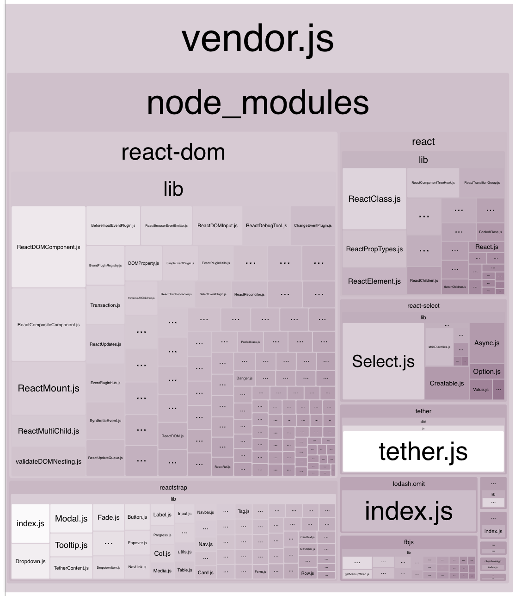

# CLI

## Table of Contents
* [NPM](#npm)
* [Commands](#commands)
    * [help](#help)
    * [start](#start)
    * [lint](#lint)
    * [build](#build)
    * [release](#release)
    * [profile](#profile)
    * [test](#test)

## NPM
> NPM requires `--` between the command and options
```bash
npm run <command> -- <options>
```

## Commands

### `help`
Show help menu for all CLI options.

### `init <projectName>`

#### Positionals
`projectName`  Required. The name of the project you want to create.

#### Options
- `--version`, `-v`:  Specify which version of the plugin project you want. [default: "latest"]
- `--current-dir`, `-c`: If you want the project to be created in the current directory
- `--template`, `-t`: The template you want to initialize the projec with
#### Examples
- `npx @availity/workflow init my-package-name`
- `npx @availity/workflow init my-package-name --template https://github.com/Availity/availity-starter-angular`
- `npx @availity/workflow init my-package-name --version 4.0.0-alpha.4`

### `start`
Start the development server and watches for file changes.  Hot-reloading is enabled for React projects.  Angular projects hot reload CSS only.

#### options

##### `--dry-run`
Start the development server using production settings. **Example:**

`npm start -- --dry-run`

### `lint`
Lint project files using EsLint.

#### options

##### `--include`
Include additional glob patterns for linting.

##### `--ignore-git-untracked`
Ignore files that are not indexed by git.

##### `--disable-linter`
Disable linter when creating bundles for production or staging.

### `build`
- Cleans up `/dist` folder
- Bundles project assets into the `/dist` folder

### `release`
- Prompts the user for a version
- Cleans up `/dist` folder
- Bundles project assets into the `/dist` folder
- Tags the version in Git

#### NODE_ENV

##### `production`
Minifies the javascript assets.

##### `staging`
No minification is done on javascript assets

#### options

##### `--dry-run`
- Disables committing files to git
- Disables creating a git tag

Skipped tasks will print a message in the console
```bash
ℹ [ Dry Run ] Skipping version bump
```

### `profile`
Analyze Webpack bundles and find what is contributing their sizes.  This command generates an html graphical chart that automatically opens in the browser as well as a text summary report in the console.



```
› Webpack profile:

react-dom: 533.24 KB (39.1%)
availity-uikit: 242.86 KB (17.8%)
reactstrap: 152.56 KB (11.2%)
react: 130.38 KB (9.56%)
react-select: 89.44 KB (6.56%)
tether: 55.04 KB (4.03%)
buffer: 47.47 KB (3.48%)
lodash.omit: 36.87 KB (2.70%)
fbjs: 30.45 KB (2.23%)
style-loader: 11.25 KB (0.824%)
process: 5.17 KB (0.379%)
react-input-autosize: 4.54 KB (0.333%)
react-hot-loader: 3.95 KB (0.289%)
lodash.tonumber: 3.91 KB (0.286%)
base64-js: 3.4 KB (0.249%)
css-loader: 2.14 KB (0.157%)
<self>: 11.71 KB (0.859%)
```


### `test`
Run the tests for your project.  The behavior of the test are determined by the plugin used in the workflow engine.  The engine supports `@availity/workflow-plugin-react` (Jest) and `@availity/workflow-plugin-angular` (Karma and Chrome|Firefox|IE) plugins.

#### options

##### `--coverage`
Indicates that test coverage information should be collected and reported in the output. React project leverage the `--coverage` option from Jest. Angular projects use Instanbul to collect coverage metrics. Angular projects output coverage statistics to the console as well as html files in the  `{workspaces}/coverage` folder.

```bash
› Started testing
Chrome 59.0.3071 (Mac OS X 10.12.5): Executed 3 of 3 SUCCESS (0.706 secs / 0.082 secs)

=============================== Coverage summary ===============================
Statements   : 27.69% ( 8620/31134 )
Branches     : 9.81% ( 1980/20189 )
Functions    : 22.15% ( 1381/6235 )
Lines        : 27.23% ( 7955/29217 )
================================================================================
✔ Finished testing
```

### `about`
Awesomeness.


## Disclaimer

Open source software components distributed or made available in the Availity Materials are licensed to Company under the terms of the applicable open source license agreements, which may be found in text files included in the Availity Materials.

## License
[MIT](../../LICENSE)


